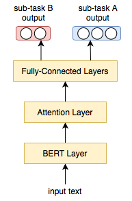

# Aggression and Misogyny Detection using BERT: A Multi-Task Approach
Our system for TRAC-2 shared task on aggression identification.  
If you find this useful, please cite our paper below:

    @inproceedings{Niloofar-Parth-etal-TRAC2020-AggressionDetection-BERT-MultiTask,
    title = {Aggression and Misogyny Detection using BERT: A Multi-Task Approach},
    author = {Safi Samghabadi, Niloofar and Patwa, Parth and PYKL, Srinivas and Mukherjee, Prerana and Das, Amitava and Solorio, Thamar}
    booktitle = {Proceedings of the Second Workshop on Trolling, Aggression and Cyberbullying ({TRAC}-2020)},
    month = {May},
    year = {2020},
    address = {Marseille, France},
    publisher = {European Language Resources Association (ELRA)},
     pages = {126--131},
    url = {https://www.aclweb.org/anthology/2020.trac2-1.20}}
    
Paper: [Aggression and Misogyny Detection using BERT: A Multi-Task Approach](http://panlingua.co.in/trac-2/pdf/2020.trac2-1.20.pdf)  
The pre-trained models for all three languages (English, Hindi and Bengali) can be found [in this drive](https://drive.google.com/file/d/1tcVhT1525pltaiTOZStwuCvNPb3X8194/view?usp=sharing).  
The datasets are available [here](https://docs.google.com/forms/d/e/1FAIpQLSesLjGKLQlE3dmQNZUEl5QJVno7NngeLTP9XvIMCvpZu7sXNg/viewform).

